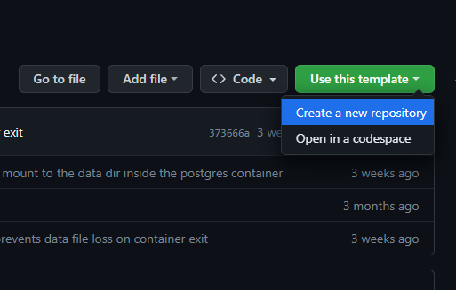
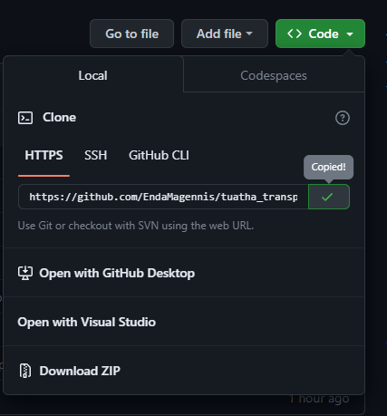
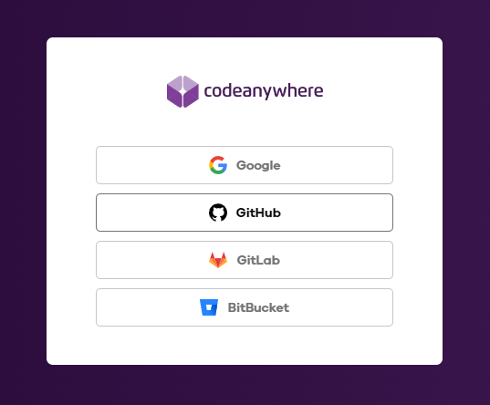
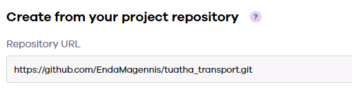
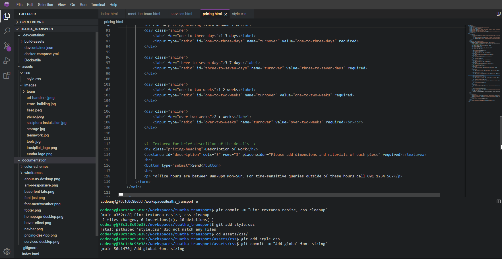
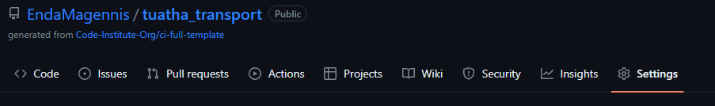
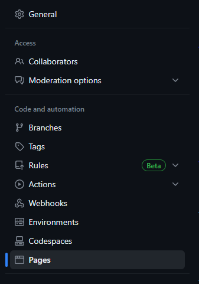
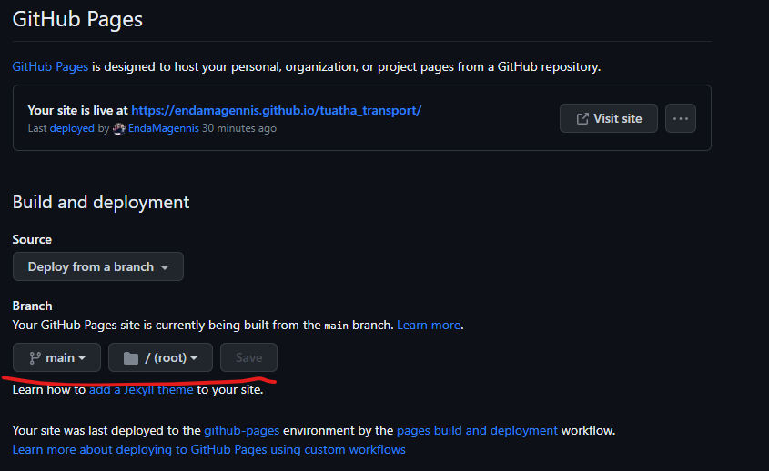

# Jump Ninja Jump

Jump Ninja Jump is a simple, interactive 2D platformer 

The site can be accessed [here](https://endamagennis.github.io/kaboomjs-ninja-game/)

---
## Background to Jump Ninja Jump

I have loved playing game for most of my life and in recent years have begun learning game development as a hobby, through Unity. This project has given me the opportunity
to expand my wheelhouse.

---
## User Stories

* As a user, I want to understand the control scheme
* As a user, I want to have an accesible control scheme
* As a user, I want to be able to play on desktop and mobile
* As a user, I want to enjoy the game, free of glitches and bugs
* As a user, I want to have an enjoyable experience and have clear progression in the game
* As a user, I want to have a reason to play multiple times

## Features

+ ### Navbar

 --- 
+ ### Home Page
    
--- 

--- 
+ ### Footer

--- 
+ ### Thank you page

--- 
## Technologies Used

--- 
## Design

### Colour Scheme

---
### Wireframes

#### Mobile devices

#### Tablets

#### Desktop

--- 
## Testing
+ ### Responsive Design

### Edge

### Firefox

+ ### Manual Testing

| Feature | Action | Expectation | Pass | Comment |
| --- | --- | --- | --- | --- |

---
+ ### Bugs

---
## Validator testing
+ ### [HTML Validator](https://validator.w3.org/)
            
+ ### [CSS Validator](https://jigsaw.w3.org/css-validator/)
      
+ ### Accessibility and performance 

---
## Deployment
- This site was deployed using Github Pages
- A repository was created on Github from the [Code Institute Full Template](https://github.com/Code-Institute-Org/ci-full-template)
    
- The repository url was copied and input as a workspace in [Codeanywhere](https://app.codeanywhere.com/)
    
    
    
- The HTML and CSS were edited in the workspace
- Using the built-in terminal, changes were git added, git committed, and git pushed to the main branch of the Github repository
    
- From the main branch of the [Github Repository](https://endamagennis.github.io/tuatha_transport/index.html), settings was selected
    
- From there I navigated to the Pages tab
    
- Under Build and Deployment, I navigated to Branch, selected main, selected root, and clicked save
    
- Github then built and deployed the site in a matter of minutes

---

## Future improvements

---
## Credits

+ #### Content
        
+ #### Media
    
+ #### Tools

---

## Acknowledgments

---

