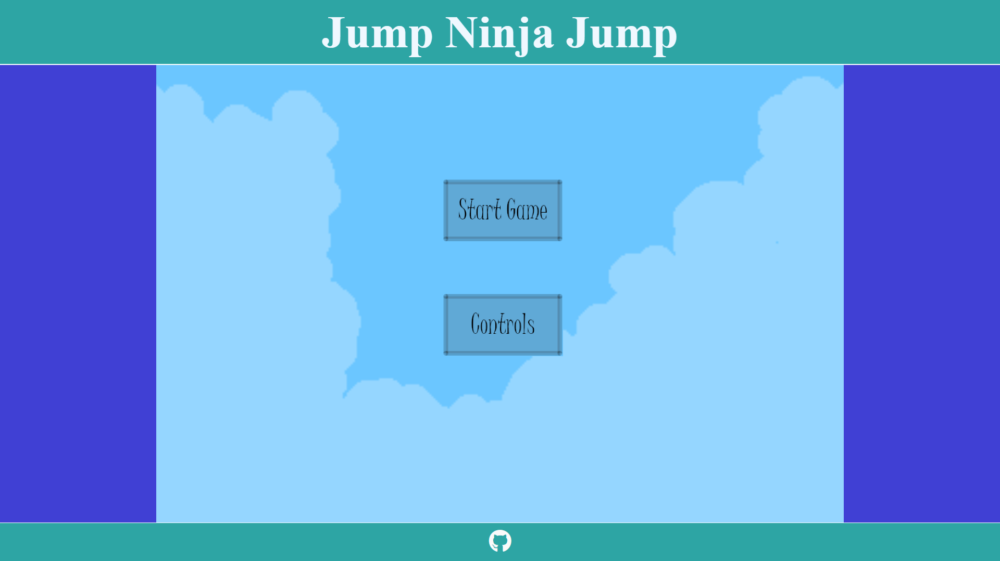
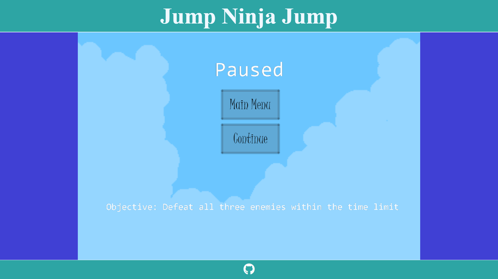
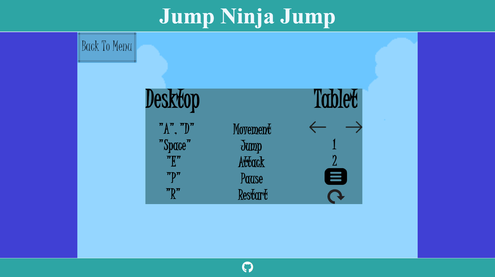
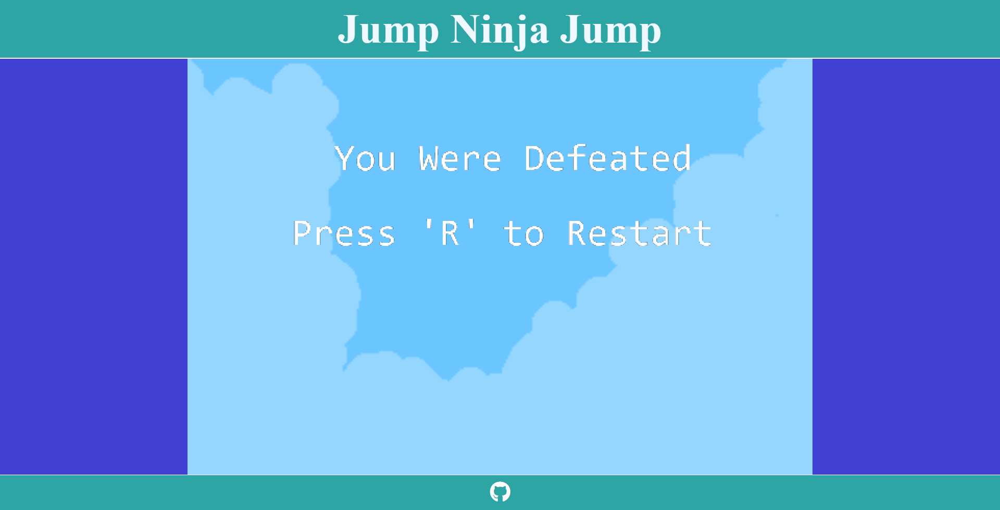
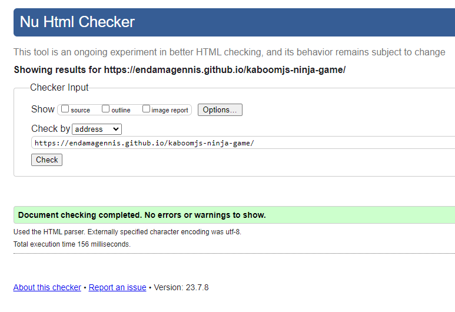
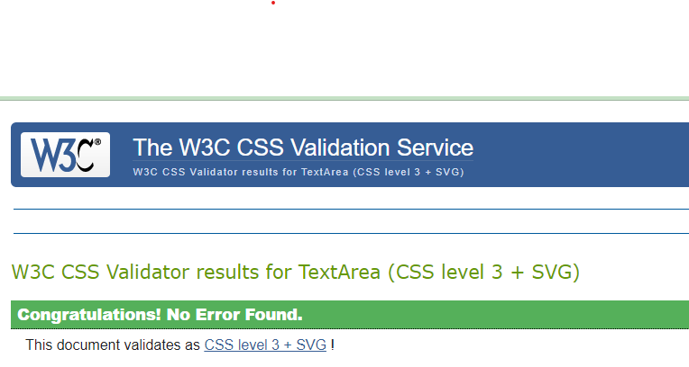
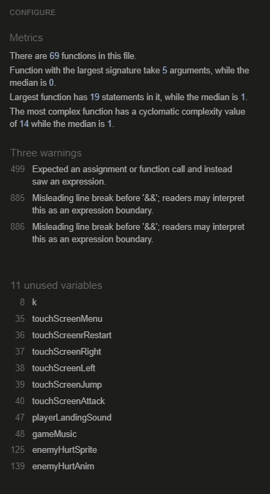

# Jump Ninja Jump 

Jump Ninja Jump is a simple, interactive 2D platformer 

The site can be accessed [here](https://endamagennis.github.io/kaboomjs-ninja-game/)

---
## Background to Jump Ninja Jump

I have loved playing games for most of my life and in recent years have begun learning game development as a hobby. Jump Ninja Jump, or JNJ, is an opportunity to merge my passion for game development with my course through a JavaScript library called [Kaboomjs](https://kaboomjs.com/). The original concept for JNJ was to scale a map and collect a maguffin, but as I grew more familiar with the [Kaboomjs](https://kaboomjs.com/) library, the scope and complexity increased. It is still, by all accounts, a simple game, but the game now encorporates enemys and combat.

---
## User Stories

* As a user, I want to understand the control scheme
* As a user, I want to have an accesible control scheme
* As a user, I want to be able to play on desktop and mobile
* As a user, I want to enjoy the game, free of glitches and bugs
* As a user, I want to have an enjoyable experience and have clear progression in the game
* As a user, I want to have a reason to play multiple times

## Features

+ ### Main Menu
    
 --- 
+ ### Pause Menu
    
--- 
+ ### Controls Menu
    
---
+ ### Game Over Screen
    
--- 
+ ### Sprite Animations
    The player and enemies each have various animations which will play when triggered through user input, or determined by other game logic.
---
+ ### Audio
    The player and the enemies make sounds when attacking or being hit. There is also music which the user can choose whether to play or not.
--- 
+ ### Fully Interactive Gamplay
    You can view a video of the gameplay [here](https://youtu.be/vprUPLwJVJE) 
---
    
+ ### Enemy AI System
    Using the Kaboomjs built-in finite state machine, enemies are able to move autonomously and decide to attack the player. When the player is out of reach, the enemy will then either ilde for a short period or continue their short patrol. 
---
+ ### Footer
    The footer contains a link to my gitHub homepage, should the user decide to follow other projects or work.
 
--- 
## Technologies Used
- [HTML](https://developer.mozilla.org/en-US/docs/Web/HTML) was the foundation of the site architecture.
- [CSS](https://developer.mozilla.org/en-US/docs/Web/css) was used for styling the HTML elements.
- [CSS Flexbox](https://developer.mozilla.org/en-US/docs/Learn/CSS/CSS_layout/Flexbox) was used for responsive design on each page.
- [JavaScript](https://www.w3schools.com/js/) was used to create the logic basis for the game.
- [Kaboomjs](https://kaboomjs.com/) tutorials and playgrounds wer used to understand the funtionality and implementation of kaboom methods and components. 
- [Balsamiq](https://balsamiq.com/) was used to make wireframes.
- [VSCode](https://code.visualstudio.com/) was used as the primary code editor.
- [Git](https://git-scm.com/) was used for the version control of the website.
- [GitHub](https://github.com/) was used to host the code and deploy the site.
- [GIMP](https://www.gimp.org/) was used to create and edit assets for the game.
- [Stack Overflow](https://stackoverflow.com/) was used for some troubleshooting and implementation.
- [Craftpix](https://craftpix.net/) was used to source the player and enemy sprites.
- [Google Images](https://www.google.com/imghp?hl=EN) was used to source some of the images.
- [Discord](https://discord.com/) was used for kaboom specific troubleshooting.
- [Microsoft Clipchamp](https://app.clipchamp.com/login) was used to create GIFs and edit videos.
--- 
## Design

### Colour Scheme
- The Header, main and footer consist of simple solid colours
- Blue-greens to match the predominant colours in the game
- The game window is the focus, so the webpage is quiet, save for the game title and GitHub logo which pop
---
### Wireframes

#### Desktop

- The early concept was much simpler. Simply get an item to progress to the next level.


- The menu layouts were basic and would look similiar across devices.

#### Tablets


- Touch screen devices would incorporate icons in order to play and navigate menus.


#### Mobile devices


- Because verticality was critical to the original concept, landscape on a mobile screen did not seem pertinent
--- 
## Testing
+ ### Responsive Design
    One drawback of the kaboom library is that the rendered assets are initialised with a height, width and position, not relative to the HTML canvas element, but to the kaboom canvas. When resizng the window in inspector mode, the kaboom canvas responds unpredictably, but when resizing the window normally, it seems to retain some semblance of responviness. In any case, under a screen width of 700px, the user will be greeted to a message explaining that the game is not yet optimised for mobile or tablet.
    
    This was achieved with [media queries](https://www.w3schools.com/css/css3_mediaqueries.asp), the ['::after' pseudo class](https://www.w3schools.com/cssref/sel_after.php), and the [CSS content property](https://www.w3schools.com/cssref/pr_gen_content.php)

### Chrome

### Edge


### Firefox


+ ### Manual Testing

| Feature | Action | Expectation | Pass | Comment |
| --- | --- | --- | --- | --- |
| Menu Navigation|
|| Click Start Game button on main menu| Initialises MainGame| Yes||
|| Press "P" during game| Runs Pause Scene | Yes ||
|| Press "Esc" during game | Runs MainMenu Scene| Yes||
|| Click Continue during pause| Returns to MainGame scene| Yes ||
|| Click Main Menu during pause| Goes to Main Menu| Yes ||
|| Click Controls button on main menu| Runs Controls scene| Yes||
|| Click Back to Menu button in controls| Returns to Main Menu| Yes||
|| Press "R" during Death scene| Reinitialises MainGame Scene| Yes ||
| Movement|
|        | Press and hold "D" | Player moves right while button is pressed| Yes |  |
|| Press and hold "A" | Player moves left while button is pressed| Yes||
|| Press "E" | Player attacks | Yes ||
|||Player attack sound plays| Yes ||
|| Press "Space" bar | Player jumps"| Yes ||
|| Release "D" | Player returns to idle state | Yes | |
|| Release "A" | Player returns to idle state | Yes | |
|| Press "Space" while holding "A" or "D"| Player jumps while moving in relavant direction| Yes||
|Footer|
| | Click on Github logo| Redirects user to my GitHub| Yes | |
---
+ ### Bugs And Fixes
    - #### Player would phase trough the ground unexpectedly (fixed)
        
        In the earlier stages of development, I had many more ground tiles as part of the map. Each of these sprites needed to be renderered during play and would cause frequent stuttering, breaking the collision between player and ground. Removing the large number of tiles, removed the most violent stuttering and allowed for smoother collisions.
    - #### When pausing during an action the game would not unpause and would crash (fixed)
    
        When performing an animation, the agent must be using the correct sprite. Because the player was already using a sprit during an action, reinitialising the scene contained the line
        ````js
        player.play("idleAnim");
        ````
        which the player would not have access to.

    - #### After this solution, a new bug was created. Now after pressing continue during pause, the player would still be in the correct state but all enemies would be reinitialised, and uable to be killed (fixed)

        This time a check was introduced to see is the player was going to the game scene from the Main Menu or the pause menu. A variable pauseCount was created and initialised to 0.
        ````js
        let pauseCount =0;
        //Later in the code
        scene("PauseMenu", () =>{
            //entering the scene increments pauseCount
            pauseCount ++;
            //more code
        })

        //later in code

        scene("MainGame", () =>{

        //checking if the game has been paused
            if(pauseCount === 0){
                //if not, initialising player and enemies
                player = createPlayer(64, 64, 100, 1620, "player");
                enemy1 = createEnemy(64, 64, 600, 1630, "enemy1");
                enemy2 = createEnemy(64,64, 461, 931, "enemy2");
                enemy3 = createEnemy(64,64, 1661, 294, "enemy3");
            }
            //more code
        })
        ````
        This means that the enemies and players will only be initialised if the game has not been paused. Otherwise they will remain in statis, with all of their settings intact. Returning to MainMenu also resets pauseCount to 0.
    
    - #### Killing one enemy took three times as many hits and also killed all other enemies (fixed)
    
        In order to reference the enemy I was hitting I had tried to make a for loop and cylce through objects labelled "enemy".
        While this worked to register the hit, each hit was cylcing through the enemies, meaning each enemy was taking damage, starting with the enemy at the 0th position in the array. Refactoring how the enemy was intantiated and updating the parameters of the onCollide() function fixed this.

    -  #### [Glitcy AI](https://youtu.be/3-czWisVgto) (fixed)
    
        Though careful reading of the documentation around kaboom's [finite state machine](https://kaboomjs.com/#state) and refactoring of enemyAI() function, the AI is much better

    - #### [Jumping animation bug](https://youtu.be/QOo6-xfK1dk) ([fixed](https://youtu.be/AnJSKXlirOY))
        
        This was a case of implementing extra checks to make sure the player was finished jumping before returning to an idle state.
---
## Validator testing
+ ### [HTML Validator](https://validator.w3.org/)

    
            
+ ### [CSS Validator](https://jigsaw.w3.org/css-validator/)

    

+ ### [JSHint](https://jshint.com/)

    
    
    For this vaildation I configured the validator to ignore undefined variables as each one was part of the kaboom library and was often a function. The unused variables listed are intended for future implementation.
      
+ ### Accessibility and performance 

---
## Deployment
- This site was deployed using Github Pages
- A repository was created on Github from the [Code Institute Full Template](https://github.com/Code-Institute-Org/ci-full-template)
    
- The repository url was copied and input as a workspace in [Codeanywhere](https://app.codeanywhere.com/)
    
    
    
- The HTML and CSS were edited in the workspace
- Using the built-in terminal, changes were git added, git committed, and git pushed to the main branch of the Github repository
    
- From the main branch of the [Github Repository](https://endamagennis.github.io/tuatha_transport/index.html), settings was selected
    
- From there I navigated to the Pages tab
    
- Under Build and Deployment, I navigated to Branch, selected main, selected root, and clicked save
    
- Github then built and deployed the site in a matter of minutes

---

## Future improvements
    - Genuine responsiveness: I hope to find a reliable way to resize and maintain the relative scale and positioning of all objects

    - Touch Screen controls: While Kaboom does have touch screen support, the documentation is lacking in how to implement it. 

    - Modular programming: When starting this project, I had hoped to create multiple scripts, each handling a major aspect of the game. However, even when using a packaging tool in a local server, the external scripts could not be imported, or used. 
---
## Credits

+ #### Content
    - [Using a tile sheet to render sprites](https://www.youtube.com/watch?v=sDeU3rbsuUo)
    - [Scene flow](https://kaboomjs.com/play?example=scenes)
    - [Enemy AI system](https://kaboomjs.com/play?example=ai)
    - [Using a fuction to instatiate player and enemies](https://www.youtube.com/watch?v=TLH0taCeE6I)
    
+ #### Media
    - [Ninja sprites and animations](https://craftpix.net/freebies/free-ninja-sprite-sheets-pixel-art/)
    - [Samuri sprites and animations](https://craftpix.net/freebies/free-samurai-pixel-art-sprite-sheets/)
    - [Grasslands sprite sheet](https://anokolisa.itch.io/basic-140-tiles-grassland-and-mines)
    - [Burger icon](https://cdn-icons-png.flaticon.com/512/5544/5544492.png)
    - [Arrow icon](https://cdn-icons-png.flaticon.com/512/109/109618.png)
    - [Chevron icon](https://cdn-icons-png.flaticon.com/512/25/25283.png)
    - [Refresh icon](https://cdn0.iconfinder.com/data/icons/glyphpack/41/refresh-512.png)
    - [Button Jump icon](https://www.maxpixel.net/static/photo/1x/Symbol-Icon-Button-1-One-Number-5433251.png)
    - [Button Attack icon](https://cdn.pixabay.com/photo/2020/07/24/08/24/icon-5433249_960_720.png)
    - [Game music](https://pixabay.com/users/muzaproduction-24990238/)
+ #### Tools
    - [Go Full Page](https://chrome.google.com/webstore/detail/full-page-screen-capture/pmabjgjpcbofkbbeiphkiaanogobokgg?gclid=CjwKCAjwyeujBhA5EiwA5WD7_StwU10jzkViA3oaRKF6qgqXOb5OYcu-fmGcBHNlfklhI1H2dHKP4RoCMDsQAvD_BwE) Used to capture entire page in .png format.
    
    - [Lighthouse](https://chrome.google.com/webstore/detail/lighthouse/blipmdconlkpinefehnmjammfjpmpbjk?gclid=CjwKCAjwyeujBhA5EiwA5WD7_StwU10jzkViA3oaRKF6qgqXOb5OYcu-fmGcBHNlfklhI1H2dHKP4RoCMDsQAvD_BwE) Used to check perfomance and accessibilty of each page.

    - [HTML Validator](https://validator.w3.org/) to validate my HTML 

    - [CSS Validator](https://jigsaw.w3.org/css-validator/) to validate my CSS

    - [JSHint](https://jshint.com/) to validate my JavaScript
---

## Acknowledgments

---

